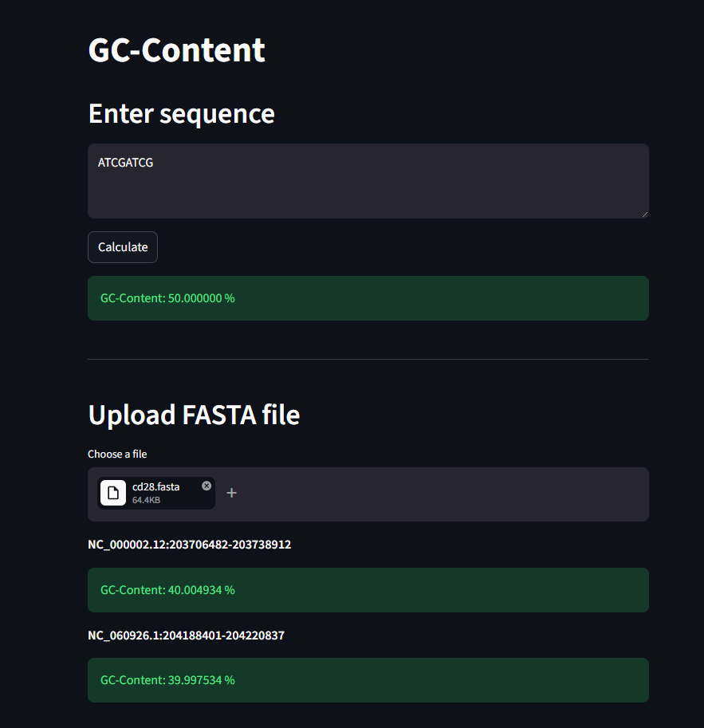

# Exercise 03 – GC Content Streamlit App

A small web application that makes the GC-content calculator from Exercise 02 accessible to other users via a browser interface. Built with Streamlit.

## Setup

Install Streamlit if not already installed:

```bash
pip install streamlit
```

## Usage

```bash
streamlit run app.py
```

Then open your browser at:

```
http://localhost:8501
```

Note: on WSL the browser does not open automatically, open the URL manually.

## Testing

Tested with two inputs:

- Text box input `ATCGATCG` (4 G/C out of 8 bases), result: 50.000000 %, which is correct.
- FASTA upload with `cd28.fasta`, results match the command-line output from Exercise 02:
  - `NC_000002.12:203706482-203738912`: 40.004934 %
  - `NC_060926.1:204188401-204220837`: 39.997534 %

See image below.



## Features

The app offers two ways to compute GC-content:

- Enter a raw DNA sequence directly into a text box
- Upload a FASTA file (.fasta, .fna, .fa, .txt)

For FASTA files with multiple sequences, each sequence is shown separately with its header and GC-content.

## Where to find things

| What | Where |
|---|---|
| App | [`app.py`](app.py) |
| GC-content logic | [`../exercise_02/gccompute.py`](../exercise_02/gccompute.py) (reused from Exercise 02) |

## Error handling

Errors are shown directly in the app as red Streamlit error messages, the app does not crash:

- Empty text box: error message asking for input.
- Invalid FASTA file (no valid sequences): error message shown in the browser.
- Unreadable file or invalid encoding: error message shown in the browser.

## Notes

The app reuses `compute_gc_content` and `parse_fasta` directly from Exercise 02, no logic is duplicated.
