# Exercise 07 – Data Collection Service

## Task 1 – Clone Source Code

Cloned from:
```
https://gitlab.fhnw.ch/david.herzig/backendservice
```

Files in `src/`:

| File | Description |
|---|---|
| `app.py` | Flask REST API with all endpoints |
| `datastructure.py` | Patient, Experiment, DataPoint, DataStorage classes |
| `idgenerator.py` | ID generation (UUID-based) |
| `datastructuretest.py` | Unit tests |
| `requirements.txt` | Python dependencies |
| `dev/tst/prd_env.json` | Environment configuration files |

---

## Task 2 – Postman Tests

Service started with:
```bash
cd exercise_07/src
pip install -r requirements.txt
python3 app.py
```

Running on: `http://localhost:5000`

### Request 1 – GET /
Returns basic service information.

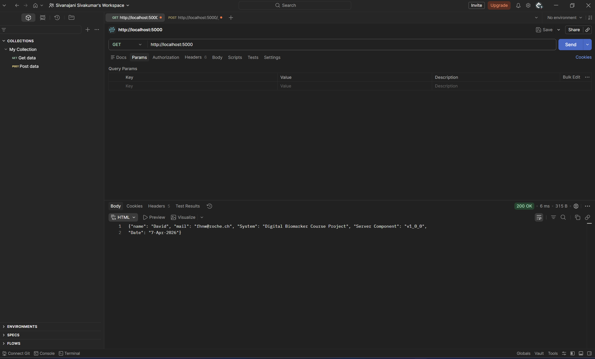

### Request 2 – POST /patient
Creates a new patient.

**Body:**
```json
{"name": "Jane Doe"}
```

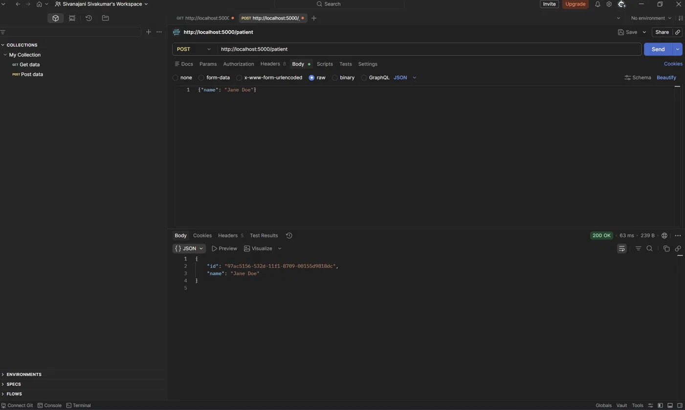

### Request 3 – GET /patient?id=
Retrieves patient by ID returned from Request 2.

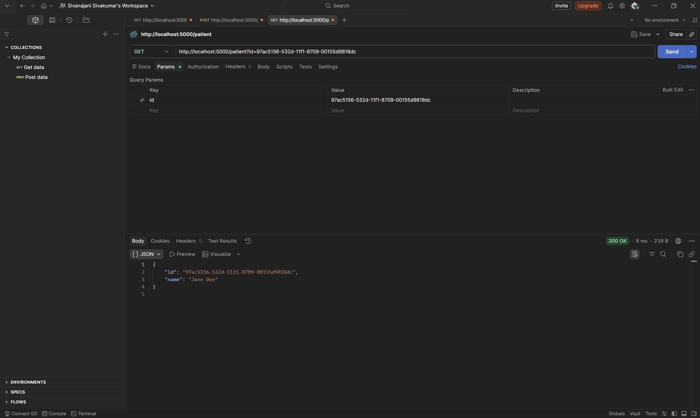

### Request 4 – POST /experiment
Creates a new experiment.

**Body:**
```json
{"name": "Tremor Study"}
```

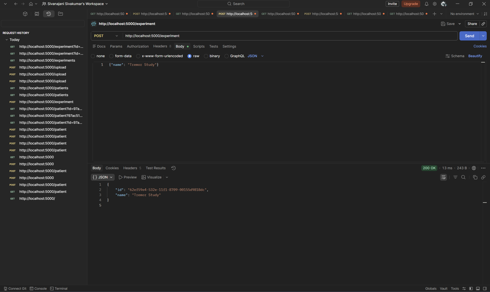

### Request 5 – GET /patients
Returns all patients.

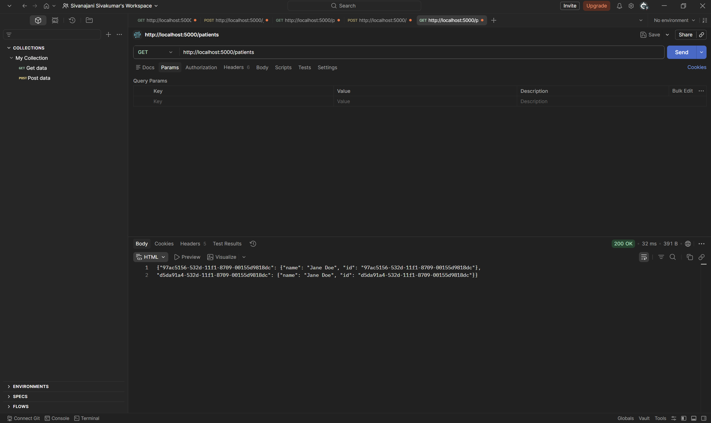

### Request 6 – POST /upload
Uploads a sensor data point.

**Body:**
```json
{
  "patientId": "97ac5156-532d-11f1-8709-00155d9818dc",
  "experimentId": "62ef59e4-532e-11f1-8709-00155d9818dc",
  "sensor": "accelerometer",
  "x": 0.12,
  "y": -0.04,
  "z": 9.81
}
```

**Response:** 200 OK (empty body)

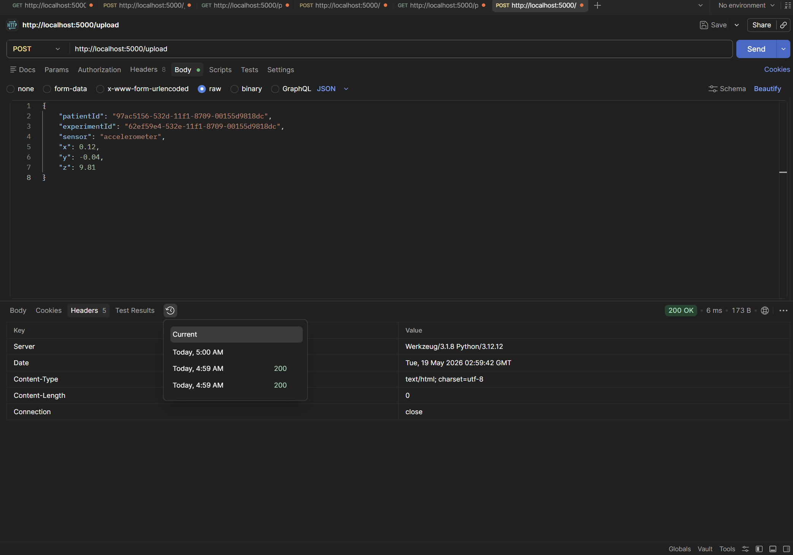

### Request 7 – GET /experiments
Returns all experiments.

**Response:**
```json
{"62ef59e4-532e-11f1-8709-00155d9818dc": {"name": "Tremor Study", "id": "62ef59e4-532e-11f1-8709-00155d9818dc"}}
```

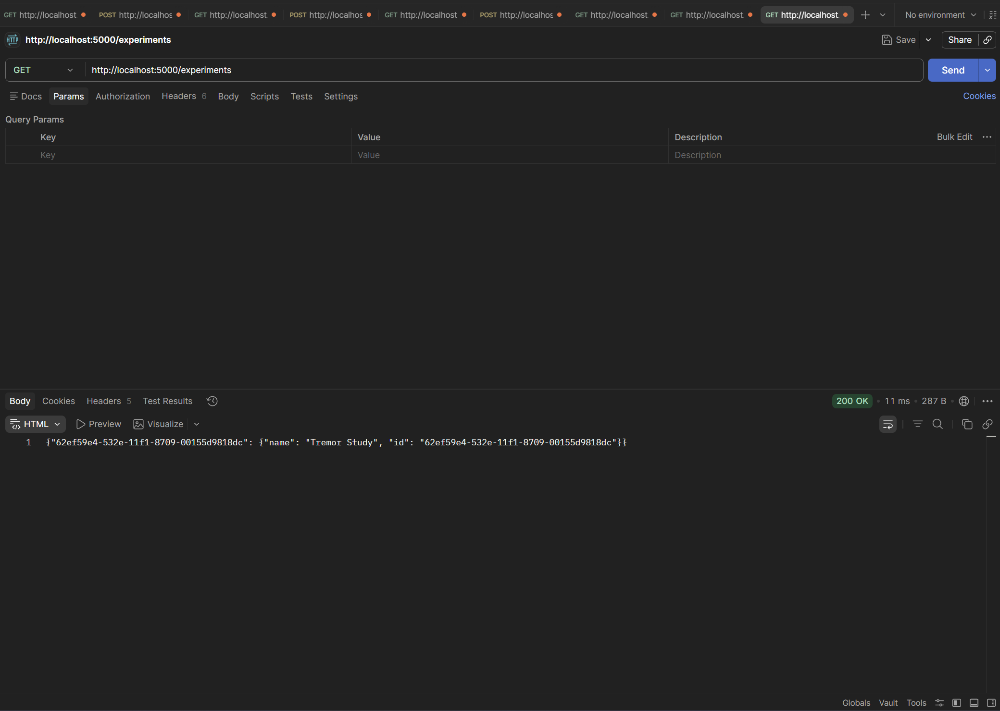

### Request 8 – GET /experiment?id=
Retrieves experiment by ID.

```
GET http://localhost:5000/experiment?id=62ef59e4-532e-11f1-8709-00155d9818dc
```

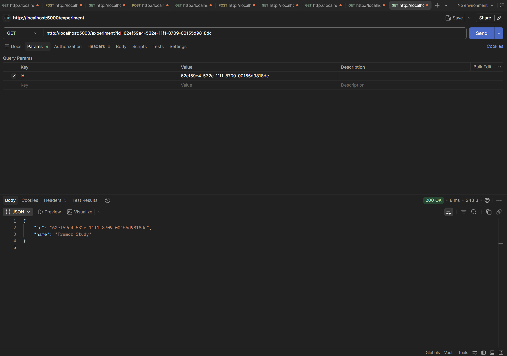

### Request 9 – POST /store
Persists all data to JSON files on disk. Response: 200 OK.

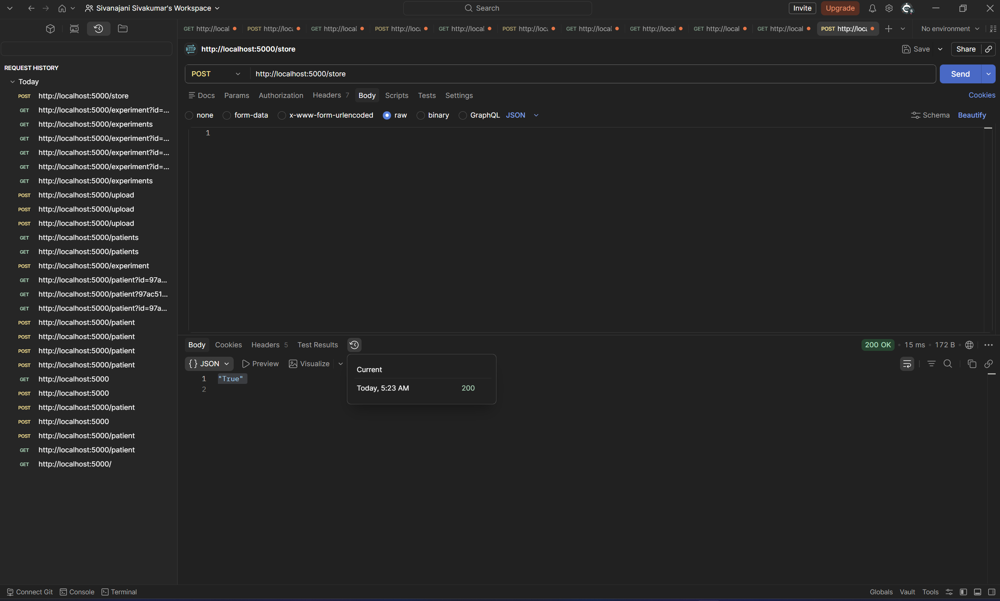

### Request 10 – Error: POST /patient without body
`POST http://localhost:5000/patient` with empty body and no `Content-Type: application/json` header. Flask rejects the request before our code runs.

**Response:** 415 Unsupported Media Type
```
Did not attempt to load JSON data because the request Content-Type was not 'application/json'.
```

**Log output:**
```
2026-05-19 05:30:33,116 INFO 127.0.0.1 - - [19/May/2026 05:30:33] "POST /patient HTTP/1.1" 415 -
```

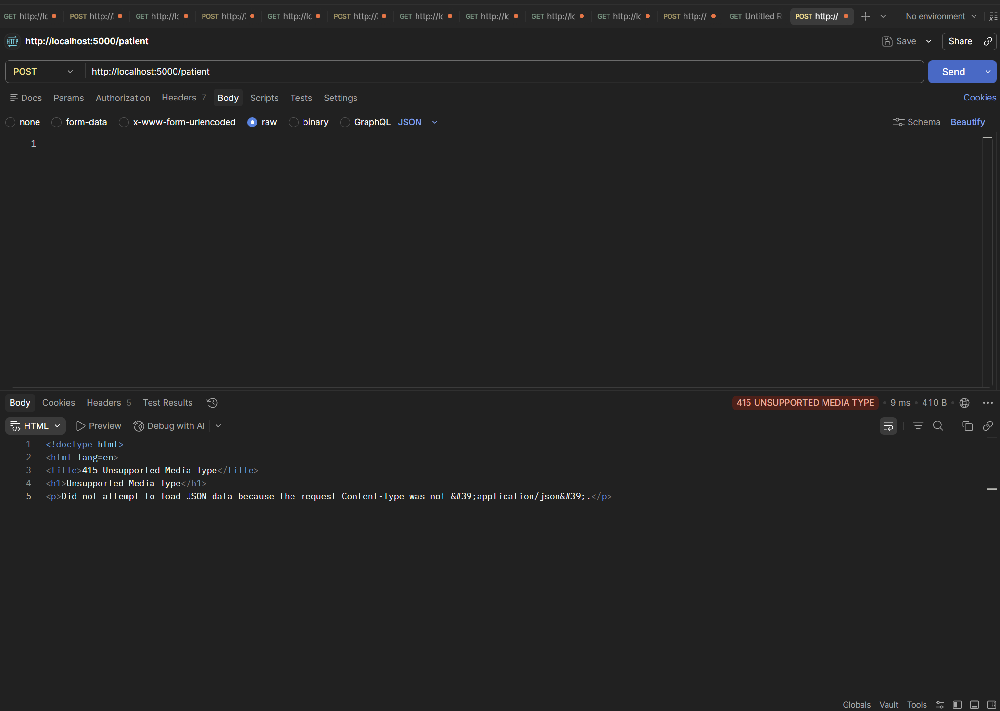

### Request 11 – Error: GET /patient with invalid ID
Tests 404 handling — patient not found.

```
GET http://localhost:5000/patient?id=INVALID
```

**Response:** 404
```json
"patient not found"
```

**Log output:**
```
2026-05-19 05:32:17,320 WARNING Patient not found: id=INVALID
2026-05-19 05:32:17,320 INFO 127.0.0.1 - - [19/May/2026 05:32:17] "GET /patient?id=INVALID HTTP/1.1" 404 -
```

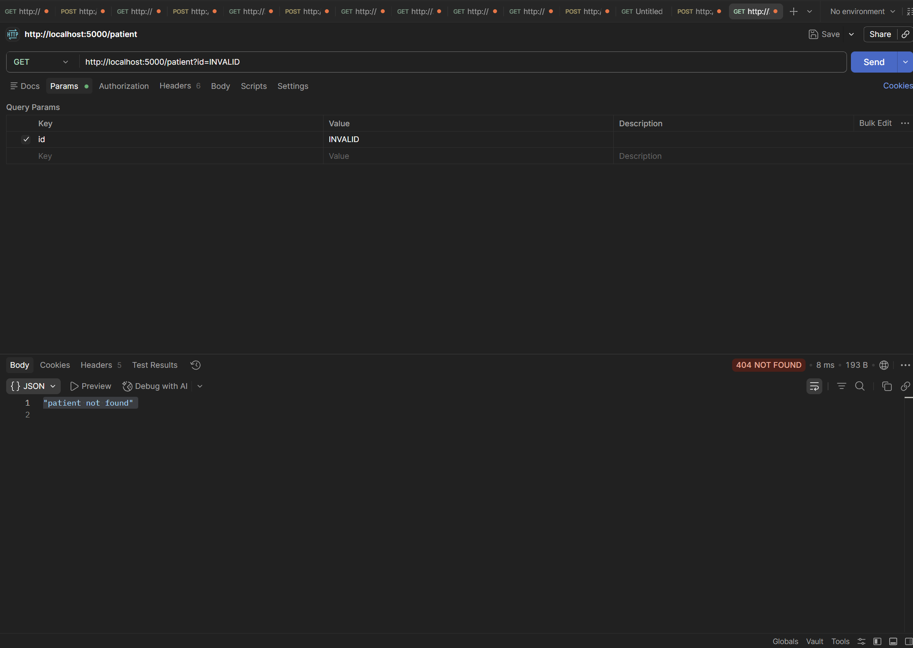

---

## Task 3 – Pylint Score

```bash
pylint app.py datastructure.py idgenerator.py
```

Final score: 10/10 (requirement: > 4.0)

Actions taken to improve the score:
- Added module docstrings to all files
- Added class and method docstrings throughout `datastructure.py` and `idgenerator.py`
- Fixed indentation in `idgenerator.py` (2 spaces → 4 spaces)
- Removed `(object)` base class from Python 3 classes
- Renamed parameter `id` to `experiment_id` / `patient_id` to avoid shadowing built-in
- Added `encoding='utf-8'` to all `open()` calls
- Fixed import order in `datastructure.py`
- Renamed `ds` in `__main__` block to `storage` to avoid outer scope conflict
- Added `# pylint: disable=too-few-public-methods` to data container classes

Progress:
```
After a few fixes:          6.58  /10
After idgenerator fixes:    7.49  /10
After app.py fixes:         7.92  /10
After datastructure fixes:  9.88  /10
Final:                      10.00 /10
```

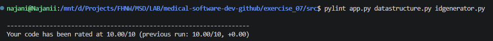

---

## Task 4 – IDE Code Checker

Pylint (VS Code) is configured as the static code checker.

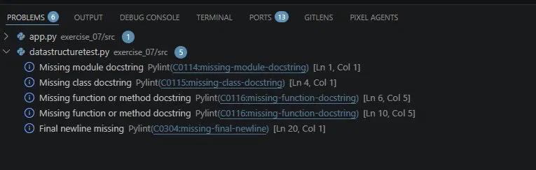

---

## Task 5 – Performance Tests

Script: `src/performance_test.py` — sends 50 requests per endpoint and measures min/avg/max response time.

```bash
cd exercise_07/src
python3 performance_test.py
```

```
Performance test — 50 requests per endpoint

Endpoint                            Status   Min ms   Avg ms   Max ms
----------------------------------------------------------------------
GET /                                  200     1.51     2.35     6.06
POST /patient                          200     1.72     2.59    12.18
GET /patients                          200     1.48     1.80     2.50
POST /experiment                       200     1.67     1.96     3.25
GET /experiments                       200     1.47     1.73     2.16
POST /store                            200     4.83     9.22    51.81
```

All endpoints respond under 15 ms on average. `POST /store` is slowest due to disk I/O (writing JSON files), with a max of 51.81 ms.

---

## Task 6 – Log File

Logging is configured at module level in `app.py` using Python's built-in `logging` module. Logs are written simultaneously to `backendservice.log` (file) and stdout (console).

```python
logging.basicConfig(
    level=logging.DEBUG,
    format='%(asctime)s %(levelname)s %(message)s',
    handlers=[
        logging.FileHandler("backendservice.log"),
        logging.StreamHandler()
    ]
)
logger = logging.getLogger(__name__)
```

Log levels used:
- `DEBUG` – routine requests (GET /)
- `INFO` – state changes (patient created, data stored)
- `WARNING` – not-found errors (invalid patient/experiment ID)

Example log output from `backendservice.log`:
```
2026-05-19 04:33:39,117 DEBUG Starting service...
2026-05-19 04:33:39,136 INFO Loaded environment from dev_env.json
2026-05-19 04:33:39,193 INFO Created patient: id=97ac5156-532d-11f1-8709-00155d9818dc name=Jane Doe
2026-05-19 05:32:17,320 WARNING Patient not found: id=INVALID
2026-05-19 05:35:01,044 INFO Data stored to disk
```

---

## Task 7 – Assertions

Assertions added to all POST endpoints in `app.py` to validate incoming request data before processing.

**POST /patient:**
```python
assert body is not None, "Request body must be JSON"
assert 'name' in body, "Field 'name' is required"
assert isinstance(name, str) and name.strip(), "Patient name must be a non-empty string"
```

**POST /experiment:**
```python
assert body is not None, "Request body must be JSON"
assert 'name' in body, "Field 'name' is required"
assert isinstance(name, str) and name.strip(), "Experiment name must be a non-empty string"
```

**POST /upload:**
```python
assert body is not None, "Request body must be JSON"
assert 'patientId' in body, "Field 'patientId' is required"
assert 'experimentId' in body, "Field 'experimentId' is required"
```

If an assertion fails, Flask returns a `500 AssertionError` with the error message.

---

## Task 8 – Unit Tests

Unit tests in `src/datastructuretest.py`:

```bash
cd exercise_07/src
python3 -m unittest datastructuretest.py -v
```

Tests written:

| Test | What it verifies |
|---|---|
| `test_data_storage_initialization` | DataStorage is instantiable and not None |
| `test_data_storage_singleton` | Same instance returned every time (Singleton) |
| `test_add_and_get_patient` | Patient stored and retrieved by ID correctly |
| `test_get_patient_not_found` | Unknown patient ID returns None |
| `test_add_and_get_experiment` | Experiment stored and retrieved by ID correctly |
| `test_get_experiment_not_found` | Unknown experiment ID returns None |
| `test_add_data_point` | DataPoint added to data list with correct patient_id |

Output:
```
test_add_and_get_experiment (datastructuretest.TestDataStructure.test_add_and_get_experiment)
Adding an experiment should make it retrievable by ID. ... ok
test_add_and_get_patient (datastructuretest.TestDataStructure.test_add_and_get_patient)
Adding a patient should make it retrievable by ID. ... ok
test_add_data_point (datastructuretest.TestDataStructure.test_add_data_point)
Adding a data point should increase the data list length. ... ok
test_data_storage_initialization (datastructuretest.TestDataStructure.test_data_storage_initialization)
DataStorage should be instantiable and not None. ... ok
test_data_storage_singleton (datastructuretest.TestDataStructure.test_data_storage_singleton)
DataStorage should return the same instance each time. ... ok
test_get_experiment_not_found (datastructuretest.TestDataStructure.test_get_experiment_not_found)
Getting an experiment with an unknown ID should return None. ... ok
test_get_patient_not_found (datastructuretest.TestDataStructure.test_get_patient_not_found)
Getting a patient with an unknown ID should return None. ... ok

----------------------------------------------------------------------
Ran 7 tests in 0.002s

OK
```

---

## Task 9 – Git Commit & Tag

```bash
git add exercise_07/
git commit -m "feat: Exercise 07 – finalize data collection service"
git tag exercise07
git push origin main --tags
```
