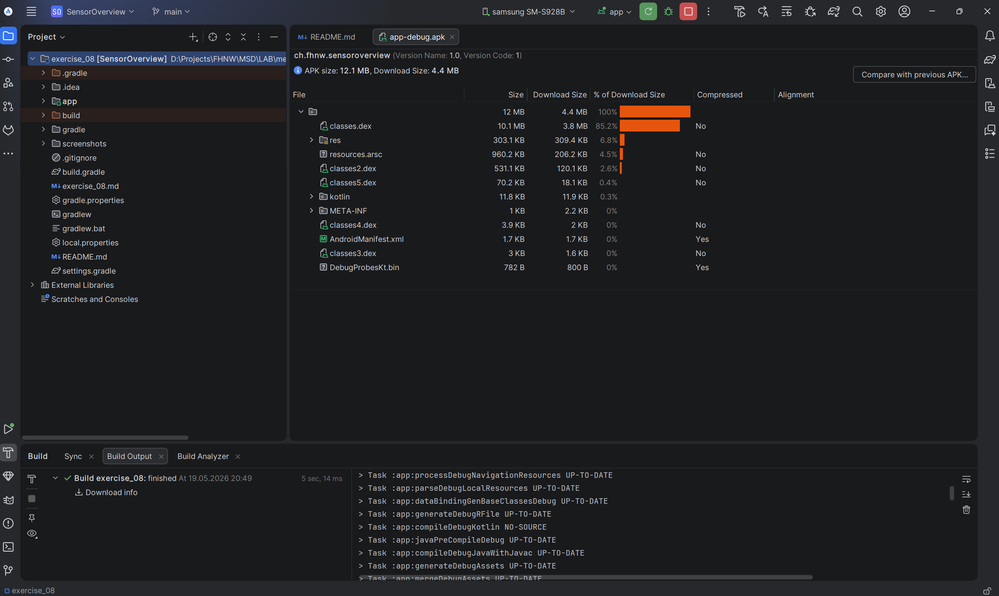
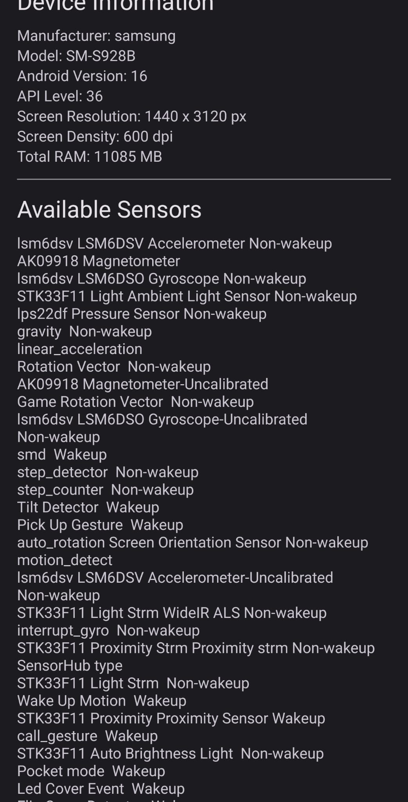
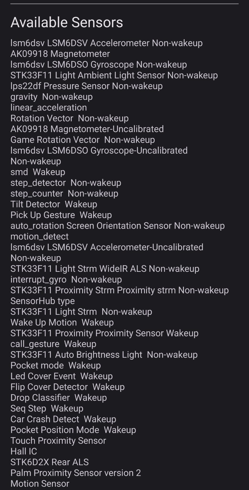

# Exercise 08 – Android Sensor Overview

## Build & Run

The app was built on Windows using the Gradle Wrapper (`gradlew.bat`) with JDK 17, since Gradle was not installed system-wide:

```powershell
.\gradlew.bat clean
.\gradlew.bat assembleDebug
```

The APK is generated at `app/build/outputs/apk/debug/app-debug.apk`.

The app was deployed and run from Android Studio. The device (Samsung SM-S928B) was connected via USB with USB debugging enabled.



## Questions

### 1. Screenshot of the app output

Device: Samsung SM-S928B, Android 16, API Level 36




### 2. Which sensor could be used to measure Parkinson's disease?

Parkinson's disease is known for resting tremors, which are involuntary rhythmic movements at around 4 to 6 Hz, mostly in the hands when the muscles are relaxed.

The accelerometer measures linear acceleration along three axes (X, Y, Z). When the phone is held in the hand, these tremors show up as periodic oscillations in the sensor signal. A frequency analysis (FFT) can be used to detect the typical 4 to 6 Hz tremor pattern.

Several studies have used smartphone accelerometers to monitor Parkinson's symptoms. The sensor lsm6dsv LSM6DSV Accelerometer Non-wakeup visible in the app is the accelerometer of the Samsung SM-S928B used in this exercise.