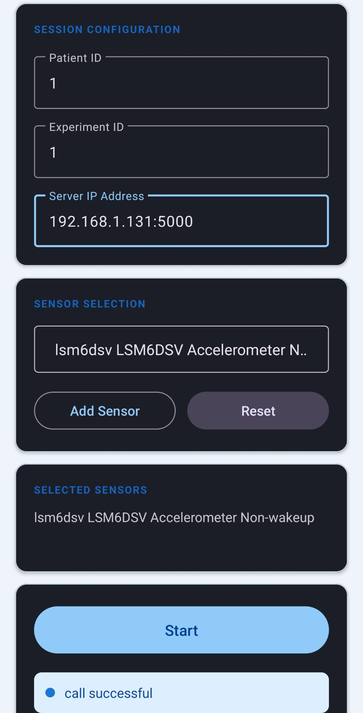
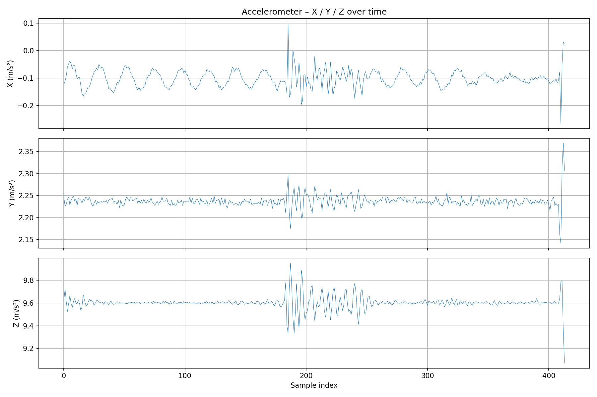
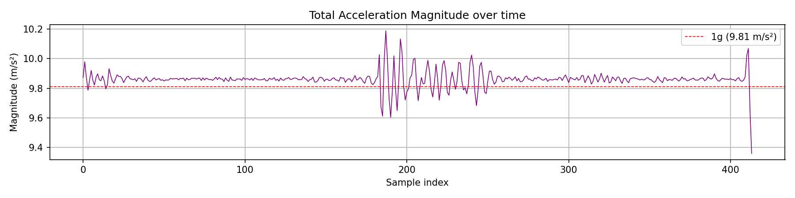
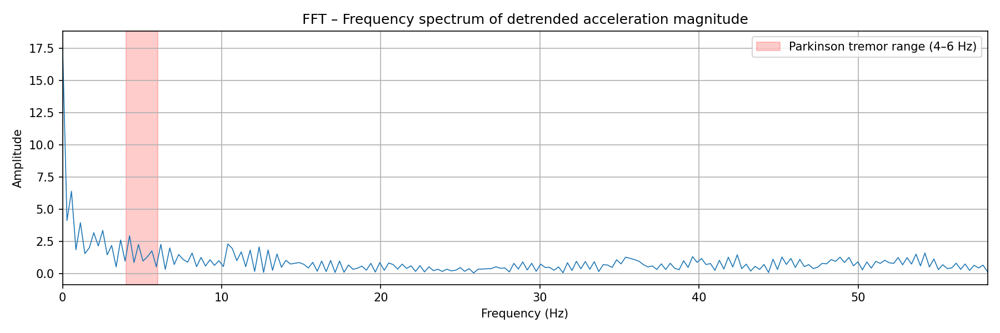

# Exercise 09: Data Collection App

## Build & Run

The app was cloned into `exercise_09/` and built using Gradle with JDK 24:


```powershell
.\gradlew.bat clean
.\gradlew.bat assembleDebug
```

The APK is generated at `app/build/outputs/apk/debug/app-debug.apk` and was installed on a physical Android device directly via Android Studio (Run button).

---

## Task 1: Select sensors and start data collection

The following sensor was selected in the app for the data collection session:

| Sensor | Purpose |
|---|---|
| Accelerometer (lsm6dsv LSM6DSV Accelerometer Non-wakeup) | Detect movement and acceleration in X/Y/Z axes |

Data was collected on a **Samsung SM-S928B** at ~116 Hz sampling rate.



---

## Task 2: Upload data to the data collection service

Sensor data was uploaded via HTTP POST to the Exercise 07 Flask service:

```
POST http://<server>:5000/upload
Content-Type: application/json

{
  "accuracy": 3,
  "data": [-0.038285162, 2.2277179, 9.667004],
  "device": "samsung SM-S928B",
  "experimentId": 3,
  "friendlyTimeStamp": "2026-05-29 01:38:56.463",
  "patientId": 3,
  "sensorId": "lsm6dsv LSM6DSV Accelerometer Non-wakeup",
  "sensorType": 1,
  "timestamp": 1503838970221209
}
```

The service responded with `200 OK` for each data point.

---

## Task 3: Store data as JSON

After uploading, the data was persisted to disk via:

```
POST http://<server>:5000/store
```

The collected data is stored in `data.json` (414 data points, included in this submission).

---

## Task 4: Basic data analysis with Jupyter Notebook

Analysis was performed in `analysis.ipynb` using Python (pandas, matplotlib, numpy).

### Dataset

| Metric | Value |
|---|---|
| Device | Samsung SM-S928B |
| Sensor | LSM6DSV Accelerometer Non-wakeup |
| Data points | 414 |
| Duration | ~3.55 seconds |
| Sampling rate | ~116 Hz |

### Analyses performed

**1. X / Y / Z axes over time**

Time-series plot of all three accelerometer axes. Shows the raw sensor values including gravity. Two movement events are visible around sample 180 and sample 420, where the device was briefly moved during the otherwise stationary measurement.



**2. Basic statistics**

```
                x           y           z
count  414.000000  414.000000  414.000000
mean    -0.101764    2.237197    9.602374
std      0.031879    0.014250    0.061702
min     -0.265603    2.141576    9.071191
max      0.098106    2.368894    9.951750
```

**3. Total acceleration magnitude**

`magnitude = sqrt(x² + y² + z²)`

Mean magnitude: **9.8602 m/s²**, which is approximately 1g. This confirms the device was mostly stationary during the measurement, with two brief movement events visible around sample 180 and sample 420.



**4. FFT frequency analysis**

The mean per axis was subtracted to remove the DC offset. FFT was applied to the magnitude signal to identify dominant movement frequencies. The Parkinson tremor range (4 to 6 Hz) is highlighted in red.

The dominant energy is concentrated at low frequencies (below 2 Hz), which corresponds to the brief movement events visible in the time-series plot. No isolated peak was found in the 4 to 6 Hz range, indicating no tremor activity was detected during this measurement.



### Output files

| File | Description |
|---|---|
| `accelerometer_plot.png` | X/Y/Z time-series plot |
| `magnitude_plot.png` | Total acceleration magnitude over time |
| `fft_plot.png` | FFT frequency spectrum with Parkinson range marked |
